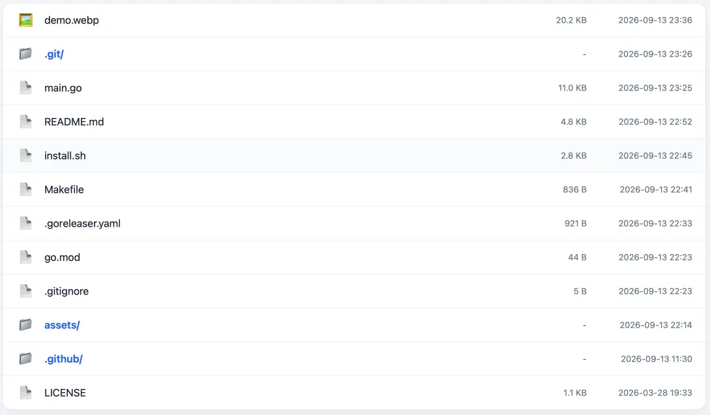
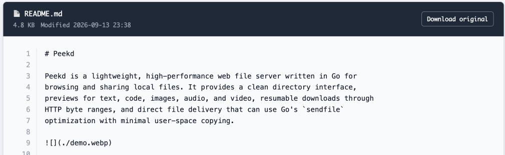

# Peekd

Peekd is a lightweight web file server for quickly browsing and sharing local
files.

| Directory | Text Preview |
| :---: | :---: |
|  |  |

## Highlights

- Rich previews for Markdown, code, text, images, audio, and video.
- Fast direct file serving with HTTP range and [`sendfile`](docs/sendfile.md) support
- Lightweight single binary with automatic dark mode

## Installation

### Download

Install the latest release on Linux or macOS:

```bash
curl -fsSL https://raw.githubusercontent.com/jiacai2050/peekd/main/install.sh | sh
```

Install a specific version or location:

```bash
curl -fsSL https://raw.githubusercontent.com/jiacai2050/peekd/main/install.sh | sh -s -- \
  --version v1.0.0 \
  --prefix "$HOME/.local/bin"
```

### Go

```bash
go install github.com/jiacai2050/peekd@latest
```

## Usage

Serve the current directory:

```bash
peekd
```

Serve another directory:

```bash
peekd -root ~/Downloads -addr :9000
```

If the selected port is occupied, Peekd tries the next port automatically.

Peekd uses the browser `Sec-Fetch-Dest` header to distinguish document
navigation from subresource requests. Markdown images and media therefore load
as original files without special query parameters.

Change the maximum Markdown and text preview size:

```bash
peekd -max-preview-size 8M
```

Supported size formats include `4M`, `512K`, `4MiB`, and byte counts such as
`4194304`.

Show version information:

```bash
peekd -version
```

## Resumable downloads

Direct file responses support HTTP range requests. Resume an interrupted
download with:

```bash
curl -C - -O http://127.0.0.1:8090/large-file.iso
```

## Development

```bash
go test ./...
go vet ./...
go build ./...
```

## License

[MIT](./LICENSE)
