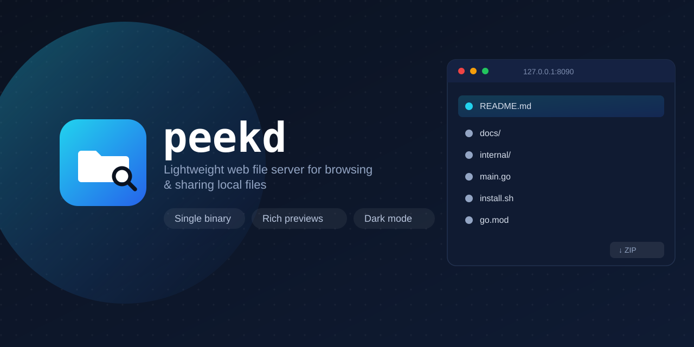
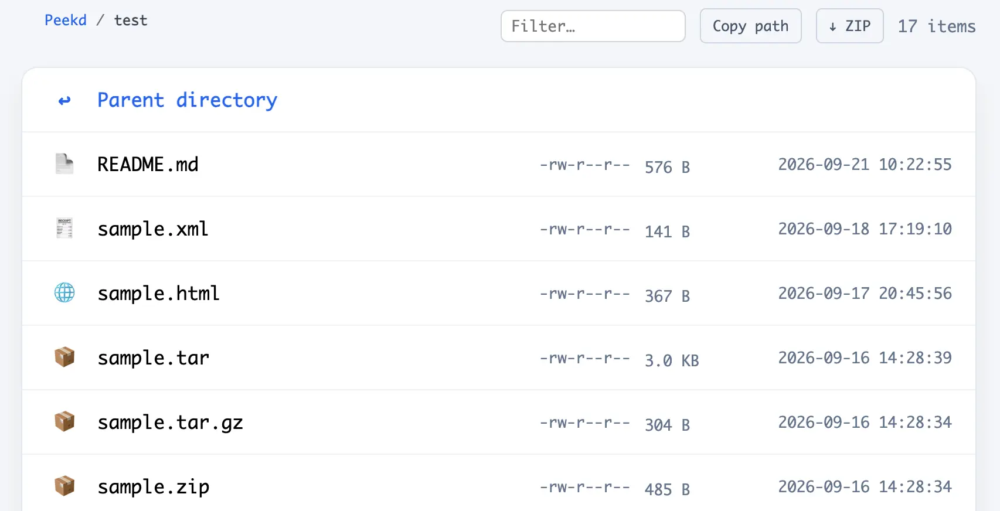
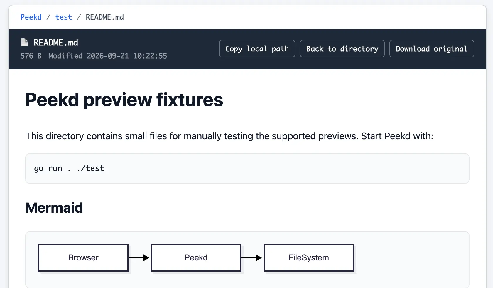
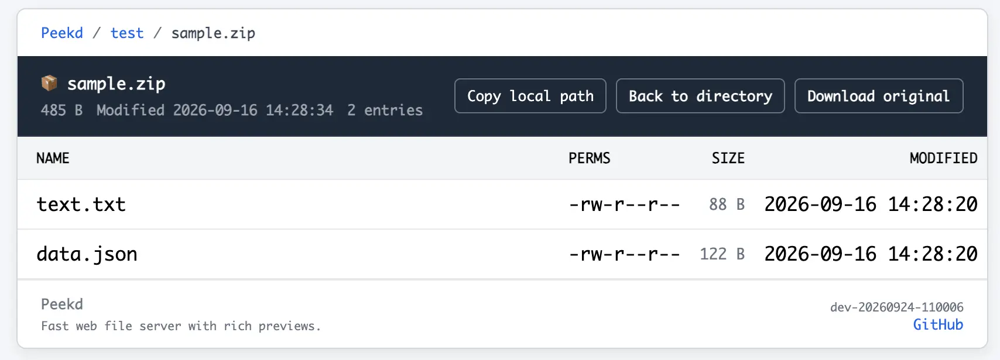
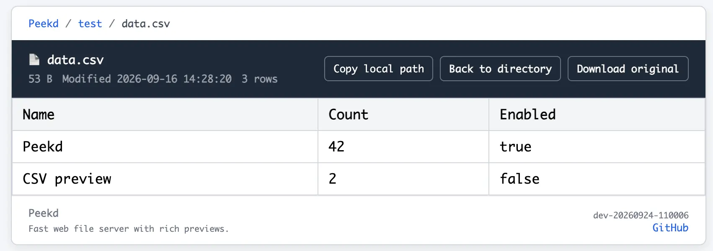

# Peekd

Peekd is a lightweight web file server for quickly browsing and sharing local
files.



> https://jiacai2050.github.io/peekd/

## Highlights

- Rich previews for markdown, org mode, html, xml, code, text, csv, tsv, images, audio, video, PDF, and standard-library archive listings (ZIP, TAR, and TAR.GZ).

|  |  |
| :---: | :---: |
|  |  |


- Fast direct file serving with HTTP range and [`sendfile`](docs/sendfile.md) support
- Lightweight single binary with automatic dark mode

## Installation

### Download

Install the latest release on Linux or macOS:

```bash
curl -fsSL https://jiacai2050.github.io/peekd/install.sh | sh
```

Install a specific version or location:

```bash
curl -fsSL https://jiacai2050.github.io/peekd/install.sh | sh -s -- \
  --version v1.2.1 \
  --prefix "$HOME/.local/bin"
```

### Go

```bash
go install github.com/jiacai2050/peekd@latest
```

## Usage

Serve the current directory:

```bash
peekd
```

Serve another directory:

```bash
peekd ~/Downloads -addr :9000
```

Serve multiple directories:

```bash
# First directory is the default root
peekd ~/Downloads ~/Work/project -addr :9000
```

- **Multi-Root navigation**: When multiple directories are served, switch roots from the directory header selector or use `?root=<index>` (e.g. `/README.md?root=1`).
- **Multi-Tab isolation**: Each browser tab operates completely independently via URL query strings without cookies cross-polluting sessions.
- **Default root**: The first directory passed on the command line is index 0 (default root); requests to it do not need `?root=`.

If the selected port is occupied, Peekd tries the next port automatically.

Peekd uses the browser `Sec-Fetch-Dest` header to distinguish document
navigation from subresource requests. Some browsers omit this header for LAN
navigation, so `Upgrade-Insecure-Requests: 1` is used as a fallback. This
header is normally sent only for top-level navigation, not subresources.
Markdown images and media therefore load as original files without special
query parameters. Add `?raw=1` to force the original file response.

Change the maximum Markdown and text preview size:

```bash
peekd -max-preview-size 8M
```

Supported size formats include `4M`, `512K`, `4MiB`, and byte counts such as
`4194304`.

Show version information:

```bash
peekd -version
```

## Basic authentication

Set both environment variables to protect the server with HTTP Basic
Authentication:

```bash
PEEKD_AUTH_USER=admin PEEKD_AUTH_PASSWORD=secret peekd
```

If only one variable is set, Peekd refuses to start. Basic Authentication
encodes credentials rather than encrypting them, so use HTTPS or a trusted
network when protecting sensitive files.

## Resumable downloads

Direct file responses support HTTP range requests. Resume an interrupted
download with:

```bash
curl -C - -O http://127.0.0.1:8090/large-file.iso
```

## Browser-local WASM previewer

Peekd also includes a browser-local build that previews selected files without
uploading them to a server. It supports files and directories, drag-and-drop,
text/code, Markdown, Org, JSON, XML, CSV/TSV, images, audio/video, PDF, and
ZIP/TAR archive listings.

Try it online: <https://jiacai2050.github.io/peekd/wasm/>.

Build and serve it over HTTP:

```bash
make wasm-build
cd wasm
python3 -m http.server 8091
```

Open <http://127.0.0.1:8091/>. Files selected from your computer stay on your
computer and are parsed locally in the browser. The page also accepts a remote
file URL; the remote server must allow browser CORS requests. Recent URLs and
files can be restored after a refresh when browser storage and permissions
allow it. Clear removes the saved history.

## Directory download

Any directory can be downloaded as a ZIP archive. Click the **↓ ZIP** button in
the directory header, or append `?download=zip` to the directory URL:

```bash
curl -O http://127.0.0.1:8090/my-folder/?download=zip
```

The archive is generated on the fly using deflate compression, preserving the
directory structure and file permissions.

## Development

```bash
go test ./...
go vet ./...
go build ./...
```

## License

[MIT](./LICENSE)
