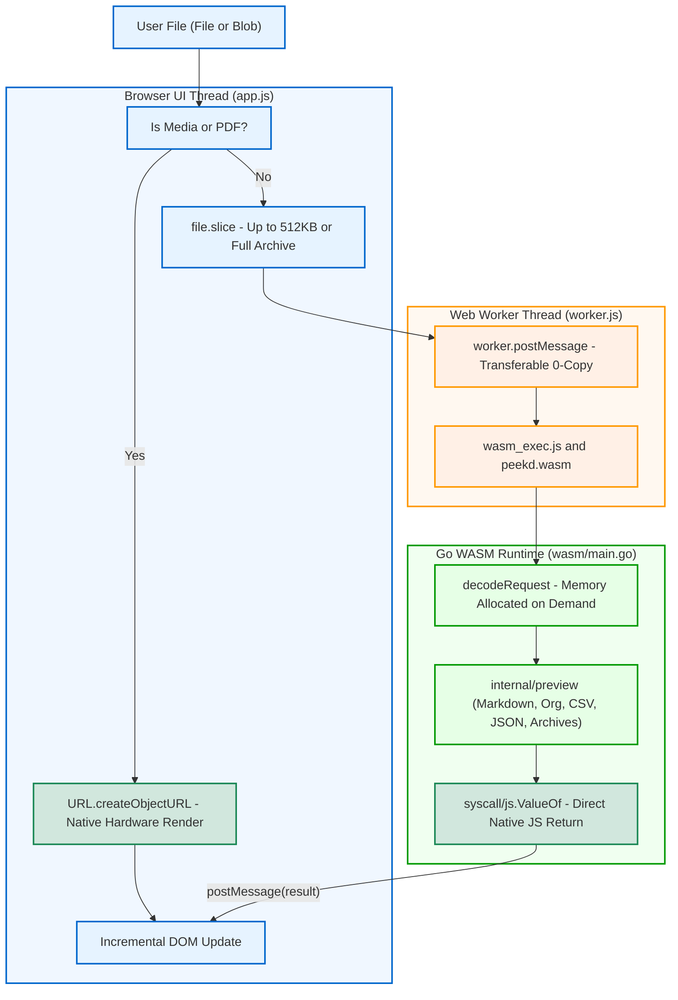

# WebAssembly Architecture & Implementation

Peekd Local runs entirely in the browser using WebAssembly (WASM). It provides the same preview parsing and rendering capabilities as the Go HTTP server, without uploading files to any external backend.

## Architecture Overview



---

## Key Design Principles

### 1. Rendering Consistency Across Targets
WASM is treated as a client-side execution target for the same rendering logic used by the Go backend. All preview logic for text, Markdown, Org-mode, JSON, XML, CSV/TSV, and archives (ZIP/TAR) directly calls `internal/preview` functions:
- Markdown rendered with `goldmark` and Mermaid diagram syntax.
- Org-mode parsed and transformed with `go-org`.
- Archives inspected using `archive/zip` and `archive/tar`.

This guarantees that formatting, line truncation, character encoding checks, and table parsing behave identically between the local CLI server and the browser previewer.

### 2. Zero-Copy Media Direct Path
Images, audio, video, and PDF files are handled by native browser engines:
- `directPreviewKind()` identifies media files by MIME type or extension.
- The UI thread uses `URL.createObjectURL(file)` to render ``, `<audio>`, `<video>`, and `<iframe>` elements directly.
- **Physical cost**: 0 bytes copied into Web Worker memory, 0 bytes loaded into WebAssembly linear memory.

In `wasm/main.go`, `decodeRequest()` also guards against accidental byte copies: if a media file extension is encountered, it skips `make([]byte)` and `js.CopyBytesToGo` entirely.

### 3. Worker Transferable Communication
When non-media files need parsing, `app.js` reads an `ArrayBuffer` slice and transfers it to the worker:
```javascript
worker.postMessage({
  type: "preview",
  id,
  file: { name: file.name, type: file.type, size: file.size, lastModified: file.lastModified },
  data,
}, [data]); // Transferable Objects: ownership transferred without structuredClone
```
This avoids memory duplication across the thread boundary.

### 4. Direct JS Object Construction (Eliminating JSON Overhead)
Earlier implementations converted Go structs to JSON via `json.Marshal`, passed the string to JavaScript, and parsed it via `JSON.parse`.

The current implementation constructs native JavaScript objects directly using `syscall/js`:
- Arrays are instantiated with `js.Global().Get("Array").New(len)`.
- Objects are populated directly via `.Set(key, val)`.
- This eliminates the double serialization/deserialization CPU cost and cuts down intermediate garbage collection pressure.

### 5. Linear Memory Growth Protection
WebAssembly linear memory (`memory.grow`) can only expand and is never shrunk back to the operating system by browser runtimes.
- **Text & Code**: Reads are strictly capped at `maxPreviewBytes` (512 KiB + 1). Only the needed prefix is sent into Go linear memory.
- **Media Files**: Never copied into Go linear memory.
- **Archive Files**: The full file is passed so that the ZIP Central Directory at the end of the file can be inspected without decompression.

---

## Robustness & Edge Cases

### Breadth-First Directory Traversal
In directory selection (`showDirectoryPicker` or `webkitdirectory`), recursive traversal with `[...spread]` can exceed the call stack depth on large folder structures.

`app.js` uses an iterative Breadth-First Search (BFS) queue:
```javascript
async function readDirectory(handle, prefix = "") {
  const files = [];
  const queue = [{handle, prefix}];
  while (queue.length) {
    const current = queue.shift();
    for await (const [name, child] of current.handle.entries()) {
      if (child.kind === "file") {
        const file = await child.getFile();
        setPeekdPath(file, current.prefix + name);
        files.push(file);
      } else if (child.kind === "directory") {
        queue.push({handle: child, prefix: current.prefix + name + "/"});
      }
    }
  }
  return files;
}
```

### Avoiding Call Stack Overflow
All spreads of `FileList` or `DataTransferItemList` (`[...fileList]`) are replaced with `Array.from()` to prevent `RangeError: Maximum call stack size exceeded` in browsers when handling thousands of files.

### In-Place DOM Updates & Debounce
- **Incremental Selection**: Selecting a file toggles CSS classes (`updateSelection`) instead of rebuilding the entire file list DOM.
- **Debounced Filtering**: Filter inputs debounce DOM re-rendering by 150 ms to preserve responsiveness on large file sets.
- **Batch History Restoration**: Restoring saved file sources from IndexedDB batches file additions into a single call, avoiding cascading re-renders.

---

## Build and Binary Optimization

The WASM build script (`wasm/build.sh`) applies multi-stage optimizations:

1. **Compiler Flags**:
   ```sh
   GOOS=js GOARCH=wasm go build -trimpath -ldflags="-s -w" -o peekd.wasm .
   ```
   - `-s`: Strips symbol tables.
   - `-w`: Strips DWARF debug information.
2. **Binaryen Optimization (`wasm-opt`)**:
   If `wasm-opt` is installed, it runs an `-O2` optimization pass:
   ```sh
   wasm-opt -O2 peekd.wasm -o peekd.wasm
   ```
   This reduces binary size from ~9.4 MB down to ~8.8 MB and improves execution performance.
