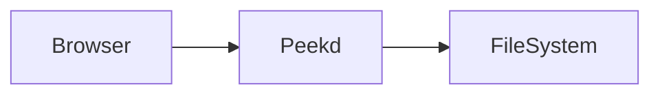

# Peekd preview fixtures

This directory contains small files for manually testing the supported
previews. Start Peekd with:

```sh
go run . ./test
```

## Mermaid



## Footnote

Peekd supports Markdown footnotes.[^1]

[^1]: This is a footnote fixture.

## Definition list

ETag
: A validator for a cached resource version.

## GFM

- [x] Task list item
- [ ] Unfinished task

| Format | Preview |
| --- | --- |
| JSON | Formatted |
| CSV | Table |

~~strikethrough~~ and an autolink: https://example.com
